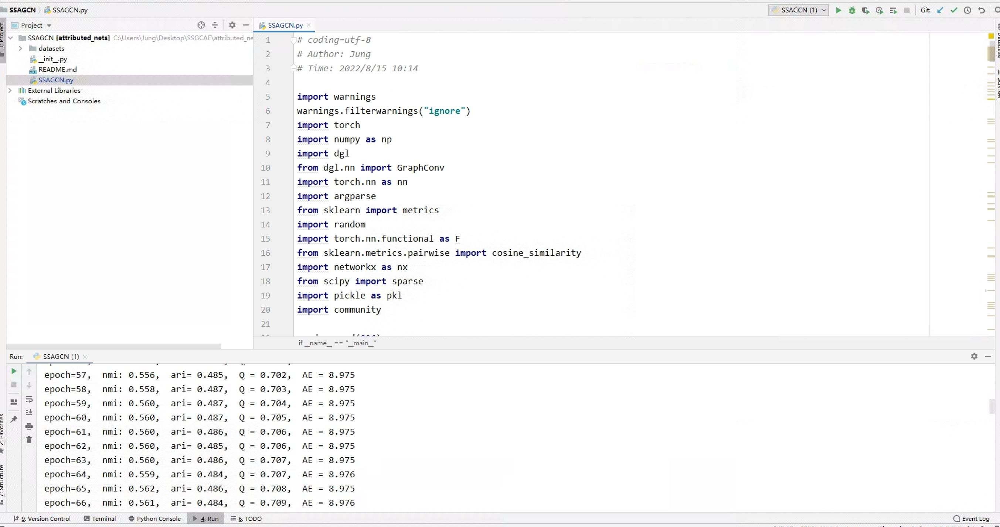

# Detecting communities with multiple topics in attributed networks via self-supervised adaptive graph convolutional networks
Chaobo He, Junwei Cheng, Guohua Chen, Quanlong Guan, Xiang Fei and Yong Tang. Submitted to information fusion.

# Training
    python SSAGCN.py --dataset cora --lr 0.001 --epochs 500 --topK 10

# Result instance
We take cora as an example to show the training results.

  

